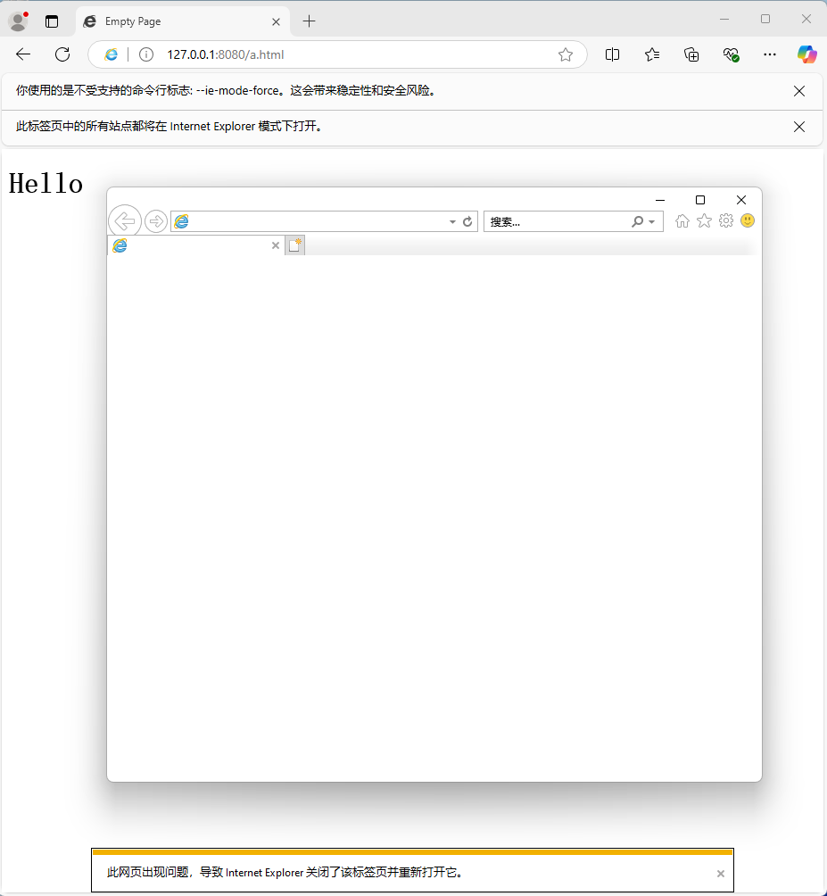

# reproduce ie driver crash

A reproduce for ie driver crash.

## reproduce steps

1. Run `py -3.12 -m venv .env` to create a virtual environment.
2. Open 2 terminals. Run `.\.env\Scripts\Activate.ps1` to activate the environment.
3. In terminal 1, run `python -m http.server -b 127.0.0.1 8080` to start a http server.
4. In terminal 2, run `python main.py` to start selenium driver.
5. Wait for the driver to crash.

## Screenshot:

